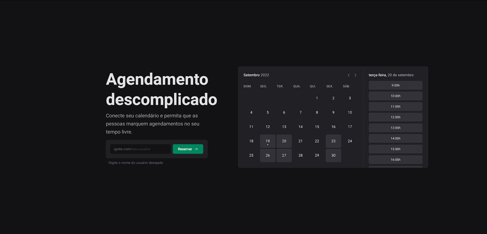

# Ignite Call - Uncomplicate your schedule 📅

<br>

<p align="center">
  <a href="#-about-the-project">About the project</a> •
  <a href="#-technologies">Technologies</a> •
  <a href="#-getting-started">Getting started</a> •
  <a href="#-license">License</a>
</p>

<p align="center">
 
 
  
</p>

## 👩‍💻 About the project

This application is a FullStack project that allows users to create appointments in Google Calendar. By logging in with their Google account, users can filter available schedules and create appointments on their desired dates, which will be automatically registered in Google Calendar.

To achieve this, the project makes use of powerful tools such as the NextJS framework, ORM Prisma, and MySQL database. The authentication with Google was implemented through NextAuth and Google's API, working with token management and cookies. The application's UI was styled using a Design System developed by me, called [Ignis Design System](https://github.com/leandrorodrigues00/ignis-design-system), which greatly facilitated the project's creation.

Combining these technologies, this project offers a complete solution for scheduling and appointment management with seamless Google Calendar integration.  

Built during [Rocketseat](https://rocketseat.com.br/) ReactJS course, where I was able to deepen my knowledge of this front-end library

[click here, see closer](https://ignite-call-cs.vercel.app/) 😉

## 🔖 Layout

You can view the project layout through the links below:

- [Layout in Figma](<https://www.figma.com/file/0oe9iRRY75PKV2MJ9NwYGd/Ignite-Call-(Community)?t=Jzm6iBcO9KBE8ekm-0>)

> Remembering that you need to have a [Figma](http://figma.com/) account to access it.

## 🚀 Technologies

- [NextJs](https://nextjs.org/)
- [Ignis Design System](https://github.com/leandrorodrigues00/ignis-design-system)
- [DayJs](https://day.js.org/)
- [Prisma](https://www.prisma.io/)
- [NextAuth.js](https://next-auth.js.org/)
- [MySQL](https://www.mysql.com/)
- [React hook form](https://react-hook-form.com/)
- [Zod](https://github.com/colinhacks/zod)

## 💻 Getting started

### Requirements

- [Node.js](https://nodejs.org/en/)
- [Yarn](https://classic.yarnpkg.com/) or [NPM](https://www.npmjs.com/) _(examples are with NPM)_
- [MySQL](https://www.mysql.com/) or a [Docker](https://hub.docker.com/_/mysql) container with a MySQL server instance

**Clone the project and access the folder**

```bash
$ git clone https://github.com/leandrorodrigues00/ignite-call && cd ignite-call

```

**Follow the steps below**

```bash
# Install the dependencies
$ npm i

# Make a copy of '.env.example' to '.env'
# and set with YOUR environment variables.
$ cp .env.example .env

# Start the database with docker
$ docker run --name mysql -e MYSQL_ROOT_PASSWORD=my-secret-pw -p 3306:3306 mysql:lates


# Start the app
$ npm run dev
```

## 📝 License

This project is licensed under the MIT License - see the [LICENSE](LICENSE) file for details.

---

<p align="center">
  Made with 💜&nbsp; by  Leandro Rodrigues
</p>
